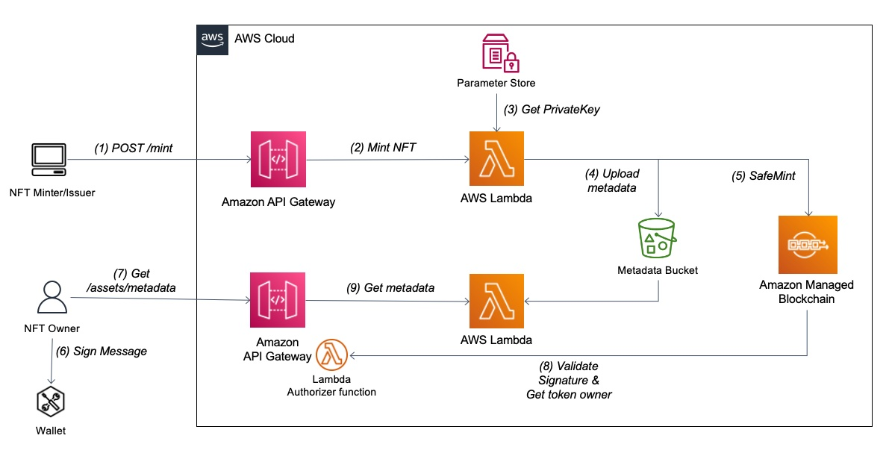
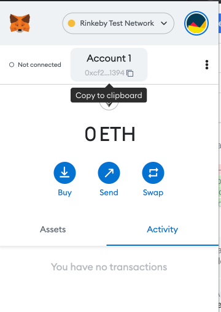
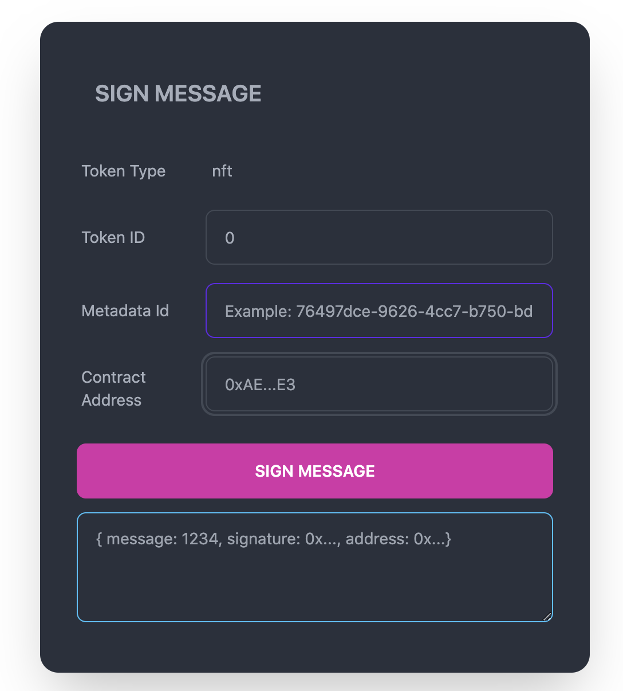

## Building NFT Metadata Access Control with Ethereum signatures and AWS Lambda Authorizers

This repository contains sample code to authorize requests to NFT metadata based on Ethereum signing capabilities and the use of Lambda authorizers. It provides a reference architecture and uses AWS SAM to provision the relevant resources in order to deploy ERC-721 smart contract as well as mint, and sign messages to access the underline metadata. By using this solution we can ensure that only authorized users (e.g. NFT owner) are able read the NFT metadata contents.

The repo is structured as follows:

```
.
├── CODE_OF_CONDUCT.md
├── CONTRIBUTING.md
├── LICENSE
├── README.md
├── images
└── serverless
└── client
└── truffle
```

<!-- For more details on how to use this repo please refer to the following [blog](https://....). -->

## Reference architecture



### Pre-requisites

1.	An AWS account with a VPC and a public subnet. Ensure you have permissions to make objects in the S3 bucket public
2.	AWS SAM CLI : Install the AWS SAM CLI.
3.	Node.js: Install Node.js 14, including the npm package management tool.
4.	Docker: Install Docker community edition.


### Deploy the AWS resources

To deploy the core components of the NFT access control architecture, you will use the AWS Serverless Application Model (AWS SAM)  command-line interface tools. To install SAM CLI, reference the [documentation](https://docs.aws.amazon.com/serverless-application-model/latest/developerguide/serverless-sam-cli-install.html). From the serverless/ directory of the respository, run the following SAM CLI command to deploy the infrastructure:


```bash
cd serverless/ 
sam build
sam deploy --guided --capabilities CAPABILITY_NAMED_IAM
```

To deploy the frontend application that will be used to produce Ethereum signatures, use the following command to deploy locally using React (localhost:3000). To run this application, you must use a modern web browser like Google Chrome with the MetaMask [browser extension](https://chrome.google.com/webstore/detail/metamask/nkbihfbeogaeaoehlefnkodbefgpgknn) installed and configured. You will be prompted to sign a message with your Ethereum wallet via MetaMask. From the client/ directory of the repository, run:

```bash
cd ../client/
npm i
npm start
```

Please note, if you have not yet installed Node.js or NPM, do so before attempting to run the React app. Use the official documentation for details on installing Node.js/NPM using [Node Version Manager (NVM)](https://github.com/nvm-sh/nvm). 


### Create an Ethereum wallet for deploying your NFT smart contract

To sign and pay for a transaction on the Ethereum Rinkeby network, an Etherum wallet is required. An Ethereum wallet is comprised of a private-public key pair. You can create your own Ethereum wallet programmatically using popular [Ethereum libraries Web3](https://web3js.readthedocs.io/en/v1.5.2/web3-eth-accounts.html) and [Ethers](https://docs.ethers.io/v5/api/signer/#Wallet). 

``NOTE: This method for creating and managing an Ethereum wallet private key is not suitable for production spending keys. Do not use this wallet for mainnet Ether!``

Generate the private key using one of the aforementioned libraries and upload to [AWS Systems Manager Parameter Store](https://docs.aws.amazon.com/systems-manager/latest/userguide/systems-manager-parameter-store.html) as an encrypted string under the name ethSystemKey. Make the secure string value excludes the first two characters, 0x, of the private key.


Add some Ethereum test tokens for the Rinkeby network by entering the Ethereum address generated during wallet creation https://faucet.rinkeby.io/ and requesting test tokens. Special care must be taken with spending keys (private keys), and [AWS Systems Manager](https://aws.amazon.com/systems-manager/) might not be adequate for wallets holding actual funds in some cases.

```Note: If you are having trouble requesting testnet Ether from the Rinkeby faucet above, you may use the Chainlink Faucet (https://faucets.chain.link/rinkeby) to get small amounts of testnet Ether.```

## Step 1: Deploy the NFT smart contract (ERC721)

After an Ethereum-compatible blockchain wallet has been created for the backend NFT minting service and funded with testnet Ether, we can deploy the ERC721 token standard smart contract that we use to mint and manage NFTs to the Ethereum testnet. The ERC721 smart contract standard defines methods and functionalities to create and manage NFTs on the blockchain. To deploy the smart contract, first modify the JSON event deploy.json to define the NFT contract details such as the name, ticker symbol, and base URI for the underlying NFT content. The base URI refers to the endpoint where the metadata files reside for each NFT minted via this smart contract. 
Navigate to `Path: nft-access-control >> serverless >> test-events >> deploy.json` 

See the following code:
```
{
    "requestType": "deploy",
    "tokenName": "awsnft",
    "tokenTicker": "MZAN",
    "baseURI": "https://<api>.execute-api.<region>.amazonaws.com /nftapi/assets/"
}
```

```bash
curl -X POST https://<api>.execute-api.<region>.amazonaws.com/nftapi -H "Content-Type: application/json" -d @deploy.json
````

After the smart contract is deployed, you receive a response containing the transaction hash (ID) and contract address that you use in the next step to mint an NFT using that smart contract.


## Step 2: Mint an NFT

With the ERC721 smart contract deployed, we can invoke the _safeMint function on the smart contract to mint a new NFT with an incremented unsigned integer token ID. The first NFT created in this smart contract has a token ID of 0, the second has a token ID of 1, and so on. 

To mint, modify the mintAddress variable in the mint.json event file. The mintAddress is the Ethereum address (not necessarily the same address as the one that deployed the contract) that the token ownership is transferred to upon the creation of the NFT. In this case, copy the address from your MetaMask wallet and enter it as the address to mint to. Navigate to `Path: nft-access-control >> serverless >> test-events >> mint.json`

See the following code:

```
{  
    "requestType": "mint",  
    "contractAddress": "<your deployed contract address>",  
    "mintAddress": "<your Ethereum address>",  
    "gasLimit": 9000000,  
    "gasPrice": 99999999999,  
    "metadata": {    
        "description": "useful description",     
        "image": "<your nft image url>",     
        "name": "The best nft"  
        }
}

```

```bash 
curl -X POST https://<api>.execute-api.<region>.amazonaws.com/nftapi/mint -H "Content-Type: application/json" -d @mint.json
````



This minting function mints a new NFT and assigns its owner to the Ethereum address copied from your MetaMask wallet, and stores the metadata attributes defined in mint.json within an S3 bucket for retrieval later. With the Lambda authorizer deployed earlier, this metadata is only accessible by the owner of the NFT. Any requests to retrieve this metadata are authenticated by verifying an Ethereum signature from your Ethereum-compatible blockchain wallet in MetaMask. The private key signature produced by your wallet proves your ownership of the address that owns the NFT corresponding to the requested metadata.

## Step 3: Get Metadata URI

To retrieve the metadata for your new NFT, you must first retrieve the metadata URI that was set in earlier steps. This metadata URI points to an API endpoint through which requests for token metadata stored in Amazon S3 are handled. To get the tokenId from the prior step, you can either find it on etherscan or change the mint configuration to wait for minting full confirmation response (not recommended for production). Once you have the minted tokenId, use it with the following code to request the metadata URI:

```bash
curl “https://<api>.execute-api.<region>.amazonaws.com/nftapi/details?contract=<your deployed contract address>&tokenId=<your minted tokenId>”
````


Copy the response, which contains the metadata URI API endpoint concatenated with the token ID provided in the request, and save it in a notepad for later.

Note that in Solidity, the view methods to retrieve NFT balances and URIs can be called with the altered `msg.sender` property to retrieve URIs, balances, and so on. The `msg.sender` property sets the origin address for a given smart contract call or transaction. 


## Step 4: Sign message

Using the Ethereum wallet via Metamask that you used to mint the NFT in an earlier step, you will sign a message that will verify that you are the owner of the NFT for which you are requesting metadata for. With the React application running from the earlier setup steps, navigate to localhost:3000 in your web browser. In the textbox, fill in the form with the token ID, metadata ID and smart contract address of your NFT and select “Sign Message”. This will trigger a popup from your MetaMask wallet that will require you to accept the signature request, which once complete, will generate a JSON signature output that can be used to verify your NFT ownership.


## Step 5: Call API to retrieve the metadata info

Finally, you can paste in the URL for your metadata API (defined in deploy.json) to submit a request to retrieve the token metadata for the NFT. The message that was signed with your wallet in the prior step will be used to prove ownership of the NFT and subsequently to authenticate your request for the token metadata. 



## Cleanup Steps

To avoid incurring future charges, delete the resources deployed throughout this blog:

1. Empty the S3 bucket which stores the underlying NFT metadata file(s).
2. Delete the ethSystemKey parameter from Secrets Manager Parameter Store.
3. Finally, delete the deployed SAM stack using the SAM CLI:

```bash
cd serverless 
sam delete nft-stack
```


## Security

Although the implementation outlined in this post is designed to be easily deployable by the reader, there are additional security considerations to be aware of in your own deployment, including but not limited to: 

* Consider deploying your Lambda functions inside a VPC construct to define clear network boundaries and ease the process of auditing connectivity and access
* Take special care in managing private keys, including Ethereum wallet private keys, and use a secrets manager or key management mechanism at all times for key storage and signing
* Consider adding a dynamic challenge to the authorization phase as part of the signing request step to avoid replay attacks
* During the deployment process, run yarn audit and npm audit commands to be aware of any possible vulnerabilities present in application dependencies

See [CONTRIBUTING](CONTRIBUTING.md#security-issue-notifications) for additional information.


## License

This library is licensed under the MIT-0 License. See the LICENSE file.